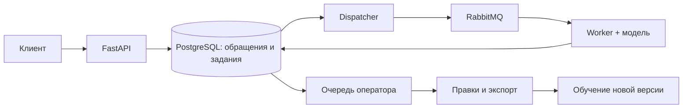

# 14. TriageDesk

**Сервис, который определяет тему обращения и отправляет его в нужный отдел.
Если модель сомневается, решение принимает оператор.**

Проект уровня Middle+ Backend + ML. Основа — FastAPI, PostgreSQL и RabbitMQ.
Для классификации используются scikit-learn и TF-IDF. Обучение идёт локально
на CPU; ключи внешних сервисов не нужны.

## Что можно показать

- Приём обращений с JWT и ключом идемпотентности. Клиент видит свои обращения,
  оператор — общую очередь.
- Классификацию по 77 темам и маршрутизацию в 8 отделов.
- Очередь ручной проверки: низкая уверенность, неизвестный язык, отсутствие
  знакомых слов или повторный сбой модели.
- Исправление темы оператором с If-Match, историей и сохранением исходного прогноза.
- Экспорт подтверждённых меток для следующего обучения.
- Сравнение двух моделей на отдельной тестовой выборке, метрики по каждому классу.
- Продолжение обработки после отказа RabbitMQ или аварийного завершения worker.
- Версию модели в каждом обращении, переключение модели для новых обращений.

## Запуск

```bash
cd ~/Desktop/Python-Backend-Portfolio/14-triage-desk
docker compose up --build -d --wait --wait-timeout 180
docker compose exec -T api python scripts/smoke.py
```

Swagger: <http://localhost:8140/docs>.

| Пользователь | Пароль | Возможности |
|---|---|---|
| `demo@example.com` | `TriageDeskDemo123!` | Создать и посмотреть свои обращения |
| `admin@example.com` | `TriageDeskDemo123!` | Проверять обращения, выгружать метки, выбирать модель |

Модель уже включена в репозиторий. Первый запуск создаёт базу, применяет
миграции и регистрирует модель. Все внешние порты привязаны к 127.0.0.1.

## Пример работы

1. Получить Bearer token через `POST /auth/login` и нажать Authorize в Swagger.
2. Создать обращение через `POST /tickets`, передав `Idempotency-Key`:

```json
{"text": "My card has been stolen", "language": "en"}
```

3. Прочитать `GET /tickets/{id}`. Для этого примера модель выбирает
   `lost_or_stolen_card` и отдел `security`.
4. Отправить `{"text":"my money","language":"en"}`. Такой короткий запрос
   попадает в `needs_review` с причиной `low_confidence`.
5. Под оператором открыть `GET /tickets?status=needs_review`. Исправить тему
   через `POST /tickets/{id}/review`, передав текущую `version` в `If-Match`.
6. Посмотреть `/tickets/{id}/events`, `/feedback/export` и `/statistics`.

Модель обучена **на английских банковских обращениях**. Русские тексты
передаются оператору. Это классификатор с фиксированным набором тем:
порог уверенности не гарантирует распознавание любой посторонней темы.

## Качество моделей

В официальной тестовой выборке BANKING77 — 3080 обращений. Модель и порог
выбраны по отдельной валидационной части, температура — по калибровочной.

| Модель | Macro-F1 | Доля автоматических решений | Точность среди автоматических |
|---|---:|---:|---:|
| TF-IDF по словам + ComplementNB | 0,7710 | 64,38% | 93,24% |
| TF-IDF по словам и символам + Logistic Regression | **0,9035** | **97,99%** | **91,35%** |

Вторая модель выбрана по validation macro-F1. Большая доля автоматических
ответов здесь относится к тесту из известных 77 тем. На реальном потоке
с другими темами результат может существенно отличаться.

Полный отчёт, включая precision/recall/F1 каждой темы:
[models/banking77-v1/evaluation.json](models/banking77-v1/evaluation.json).
Объяснение разделения данных и выбора порога — [docs/model-card.md](docs/model-card.md).

## Обучение и исправления оператора

```bash
uv sync --extra dev --frozen
uv run python scripts/train.py --version banking77-v2
```

Для обучения с исправлениями выгрузить страницы `GET /feedback/export`
и сохранить их строки в один JSON-массив. Скрипт также принимает одну страницу
в формате `{"rows":[...]}`:

```bash
uv run python scripts/train.py --version banking77-feedback-v2 --feedback feedback.json
```

Для каждого обращения берётся последняя правка. Повторы обучающего текста,
конфликтующие метки и совпадения с calibration/validation/test исключаются;
счётчики исключений попадают в отчёт. Эти правки добавляются только к train.

Новая модель автоматически не включается. Сначала изучить отчёт, затем
пересобрать контейнеры, выполнить seed и выбрать версию через
`POST /models/{version}/activate`. Пошагово: [docs/runbook.md](docs/runbook.md).

## Проверка

```bash
make check
make test
make smoke
uv run python scripts/recovery_smoke.py
```

Последняя команда временно останавливает RabbitMQ и worker **этого проекта**.
Она проверяет приём обращения без брокера и единственную запись результата
после SIGKILL воркера. Для демонстрации падения используется задержка перед
инференсом; в обычном запуске она выключена.

## Устройство проекта



- [Архитектура](docs/architecture.md): транзакции, очереди, версии и права.
- [Модель и данные](docs/model-card.md): метрики, пороги и ограничения.
- [Запуск и обслуживание](docs/runbook.md).
- [Результаты проверок](docs/verification.md).
- [Объяснение для интервью](docs/interview.md).
- [Происхождение и лицензия данных](data/README.md).

Проект создан для портфолио в сентябре 2026 года. Он демонстрирует обучение
классификатора и его подключение к backend; не описывает коммерческий ML-опыт.
